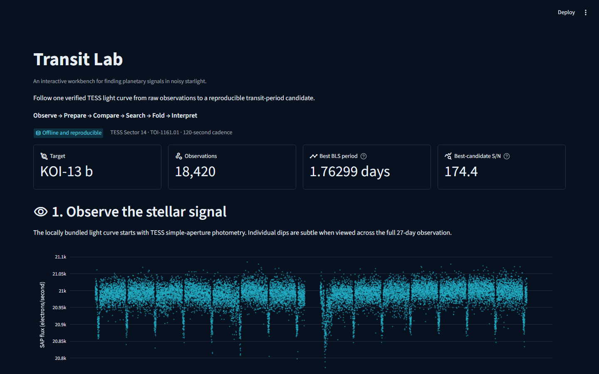

# Exoplanet Transit Lab

[](https://github.com/sebasalonsogp/exoplanet-transit-detection/actions/workflows/quality.yml)
[](https://exoplanet-transit-lab-nbwmcaxjydlejrmnvwzaug.streamlit.app/)

An interactive dashboard for exploring a planetary transit signal in TESS observations.

**[Try the live dashboard](https://exoplanet-transit-lab-nbwmcaxjydlejrmnvwzaug.streamlit.app/)**



## About

This project builds on a mini-project I completed for **MTH 520**, where I explored signal-processing methods for detecting periodic dips in stellar light curves. I developed that work into a Streamlit dashboard that follows one TESS observation from the raw signal through preprocessing, method comparison, period search, and phase folding.

Built with Python, Streamlit, Plotly, Astropy, NumPy, SciPy, and pandas.

## Highlights

- View the raw, normalized, and detrended light curve.
- Compare Fourier, SVD-assisted Fourier, and Box Least Squares results.
- Explore and phase-fold the three strongest BLS candidates.
- Run the complete analysis from bundled data without API keys or runtime downloads.

## Result

The strongest BLS candidate has a period of **1.76299 days**, about **0.9 minutes** from the [NASA Exoplanet Archive](https://exoplanetarchive.ipac.caltech.edu/overview/KOI-13) reference for KOI-13 b. The analysis uses 18,420 two-minute-cadence measurements from TESS Sector 14.

BLS detects a repeating transit-shaped signal; it does not independently confirm a planet or rule out false positives.

## Data

The light curve comes from a public [MAST TESS target-pixel product](https://mast.stsci.edu/api/v0.1/Download/file?uri=mast:TESS/product/tess2019198215352-s0014-0000000158324245-0150-s_tp.fits) for TIC 158324245 / TOI-1161.01. The processed dataset is included in the repository so the dashboard can run without network access. See [the data notes](data/README.md) for details.

## Run locally

Requirements: [uv](https://docs.astral.sh/uv/getting-started/installation/) and Python 3.12.

```powershell
git clone https://github.com/sebasalonsogp/exoplanet-transit-detection.git
cd exoplanet-transit-detection
uv sync --locked
uv run streamlit run app.py
```

Open `http://localhost:8501` if Streamlit does not open it automatically.

## Tests

```powershell
uv run pytest
uv run ruff check .
uv run mypy src app.py
```

GitHub Actions runs the same checks on pull requests and pushes to `main`.

## Project layout

```text
app.py                Streamlit app
src/transit_lab/      Analysis and visualization modules
data/demo/            Light curve, metadata, and method results
tests/                Unit and Streamlit tests
assets/astro.ipynb    Cleaned source class notebook
```
