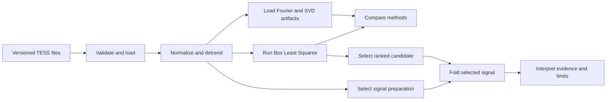

# Architecture

## Goal and boundary

Transit Lab is a single-process, read-only portfolio application. Its purpose is to make one
existing exoplanet-transit analysis understandable, interactive, and reproducible—not to act
as a general astronomy platform or a new validation pipeline.

That boundary keeps the system intentionally small: one Streamlit entry point, one typed
Python package, one versioned dataset, and no database, authentication, upload path, or
runtime API dependency.

## Execution flow

The expensive path—data loading, preparation, and BLS—is held in one bounded
`st.cache_data` entry. Candidate and preparation widgets operate on those immutable results
and repeat only phase folding, binning, and display formatting.

## Module boundaries

| Module | Responsibility |
| --- | --- |
| `app.py` | Orders the narrative, owns widget state, and renders Streamlit elements. |
| `transit_lab.models` | Defines and validates light-curve, target, and dataset contracts. |
| `transit_lab.data` | Reads versioned CSV/JSON files and converts boundary failures into clear validation errors. |
| `transit_lab.analysis` | Normalizes, detrends, searches with BLS, ranks candidates, and folds signals. |
| `transit_lab.comparisons` | Validates and loads Fourier/SVD comparison artifacts and adapts BLS to the shared score contract. |
| `transit_lab.presentation` | Converts candidate measurements into display-ready units and bounded interpretations. |
| `transit_lab.charts` | Builds consistently styled, fixed-range Plotly figures with explicit units and hover text. |

Streamlit remains an orchestration and presentation layer. Scientific transformations and
formatting live in testable modules rather than being embedded in widget branches.

## Data contract

`data/demo/light_curve.csv` contains time, raw SAP flux, raw uncertainty, normalized flux,
and normalized uncertainty for 18,420 finite observations. `target.json` records observation
identity, column definitions, processing history, source URLs, checksums, and external
reference values. `method_results.json` stores deterministic Fourier and SVD-assisted scores
regenerated from the same bundled curve.

Path resolution is repository-relative through `pathlib`; no local machine path is embedded
in application data or code.

## Method choices

The original notebook explored Fourier analysis and an SVD-assisted residual. Those methods
remain in the dashboard as reproducible comparisons. BLS is the primary detector because its
box-shaped model directly represents short transit-like dips, while a Fourier basis is better
suited to sinusoidal variation.

The notebook's experimental L1 optimizer is omitted. Reproducing and tuning it would be slow,
numerically brittle, and outside the approved goal of repackaging existing work. The project
also avoids a machine-learning classifier because one verified target does not justify a
training or evaluation pipeline.

## Failure and interaction behavior

- Missing, empty, malformed, non-finite, or misaligned data fails at typed boundaries.
- The app converts expected data/configuration failures into an intentional user-facing error
  state and keeps technical detail available for diagnosis.
- A skeleton reserves space during the cold analysis run.
- Widgets expose only three preparation modes, three comparison methods, and three ranked
  candidate periods, which bounds cache and interaction behavior.
- Plot axes are fixed and drag/scroll zoom is disabled so exploratory gestures cannot leave
  the analytical story in a misleading state.

## Verification strategy

Pure transformations use unit tests. File loading and comparison artifacts use integration
tests against the versioned demo data. Streamlit `AppTest` verifies the full default narrative,
every widget option, evidence synchronization, caching behavior, and error handling. Manual
browser checks cover rendering and responsive behavior that `AppTest` cannot reproduce.

CI installs the committed `uv.lock` environment on Python 3.12, then runs Ruff, mypy, and the
full pytest suite. Deployment uses the repository root as the working directory and `app.py`
as the entry point, matching local execution.
